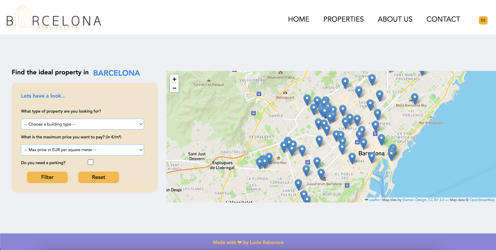
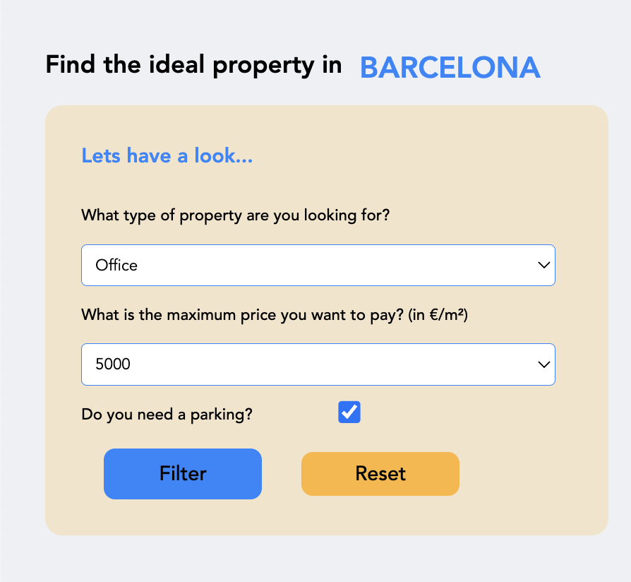
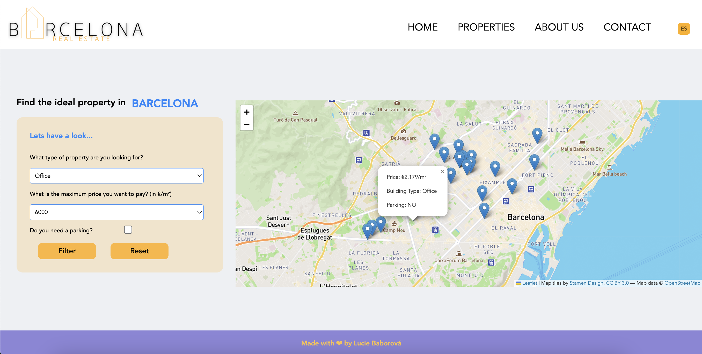

# Frontend Map App

- Frontend Real Estate Map App

- Application done using react, webpack, node.js 

Home Page

Leaflet Map with Markers based on CSV file

Filters and PopUp windows with info from CSV file

Menu

## Technologies Used

### react-leaflet-webpack-boilerplate
React and Leaflet boilerplate using Webpack 4 (see License)

### Data & Data Scraping

### Main Node Modules

`react` `react-dom`: let us use React

`leaflet` `react-leaflet`: let us use Leaflet

### Webpack Plugins

- Webpack:

`webapck`: module bundler and build tool

`webpack-dev-server`: it serves the bundled app in a local environment

`webpack-cli`: it configures webpack setup

- Babel:

`@babel/core` `@babel/preset-env`: these transpile js code to vanilla js for all browsers

`@babel/preset-react`: it transforms React's JSX syntax to vanilla js

`babel-loader`: it makes babel work in webpack

`babel-plugin-transform-class-properties`: it enables arrow functions

- CSS:

`mini-css-extract-plugin` : it extracts css which is in style tag of html file into a separated text file like bundle.css

`style-loader` `css-loader`: these get css code and put css code within the style tag of html file

`url-loader`: it transforms files into base 64 URIs enabling us to import Leaflet css file from node modules

`csv-loader`: to get the data from a csv file and convert to JSON

- HTML
`html-webpack-plugin`: it generates an HTML including hash in the filename based on the template

## Setup and Run the Project

- clone the repository

- cd into the folder

- run `npm install` in BarcelonaRealEstate

- run `npm run start` which will open the App on port 8080
