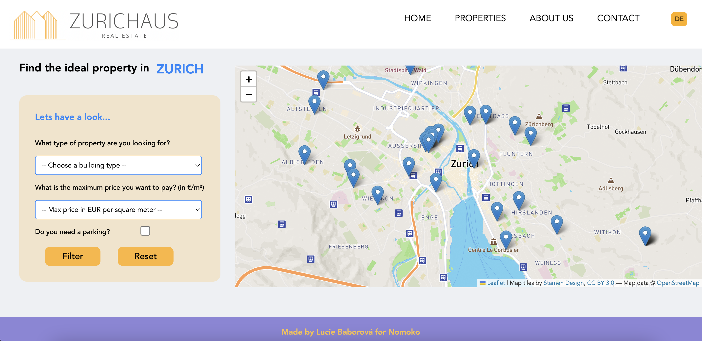
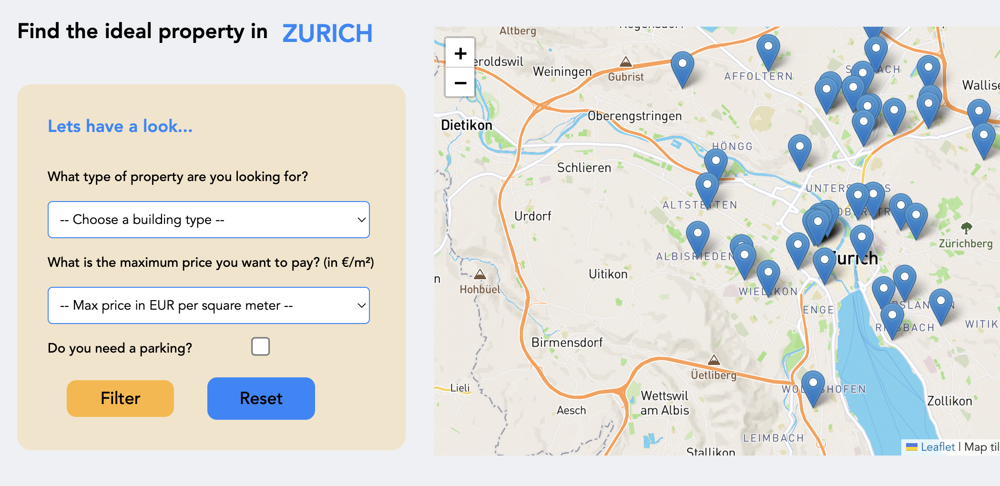

# Frontend Map App

- Frontend Map App created as part of recruitment process for Nomoko.

- Instructions:

Given a CSV file with locations and prices per square meter, building type and parking availability of properties around Zürich create a map based application that displays markers on the map with the values of this properties and a filtering system for the properties based on it's price, building type and parking. A user should be able to click one of the markers and see the property's information. The application should be done using react, webpack, node.js, sass, application should be done in English and localized for German. General design, UI and UX will be taken into consideration for this task.
Please don't share your solution via a public repository.

- Solution:

Home Page

Leaflet Map with Markers based on CSV file

Working Filters and PopUp windows with info from CSV file

Reset Filters Responsive Button

Responsive Links

Option to switch to German (only Navbar for now)

## Technologies Used

### react-leaflet-webpack-boilerplate
React and Leaflet boilerplate using Webpack 4

### Main Node Modules

`react` `react-dom`: let us use React

`leaflet` `react-leaflet`: let us use Leaflet

### Webpack Plugins

- Webpack:

`webapck`: module bundler and build tool

`webpack-dev-server`: it serves the bundled app in a local environment

`webpack-cli`: it configures webpack setup

- Babel:

`@babel/core` `@babel/preset-env`: these transpile js code to vanilla js for all browsers

`@babel/preset-react`: it transforms React's JSX syntax to vanilla js

`babel-loader`: it makes babel work in webpack

`babel-plugin-transform-class-properties`: it enables arrow functions

- CSS:

`mini-css-extract-plugin` (currently this is more friendly than `extract-text-webpack-plugin` for webpack 4): it extracts css which is in style tag of html file into a separated text file like bundle.css

`style-loader` `css-loader`: these get css code and put css code within the style tag of html file

`url-loader`: it transforms files into base 64 URIs enabling us to import Leaflet css file from node modules

`csv-loader`: to get the data from a csv file and convert to JSON

- HTML
`html-webpack-plugin`: it generates an HTML including hash in the filename based on the template

## Setup and Run the Project

- clone the repository

- run `npm install`

- run `npm run start`

## Possible Future Features

- Due to compatibility issues I did not manage to use SASS in this project, therefore this could be fixed;

- Responsivity;

- Localization for the whole app - for now only works change of language for Navbar;

- Option to switch to different map styles;

- Improvement of filters - better styling and price range slider for setting up min and max price;